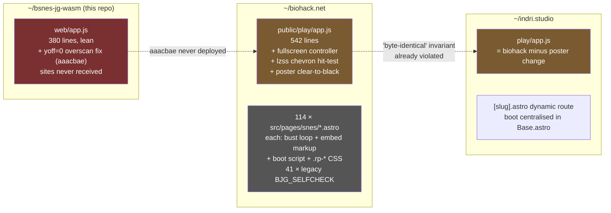
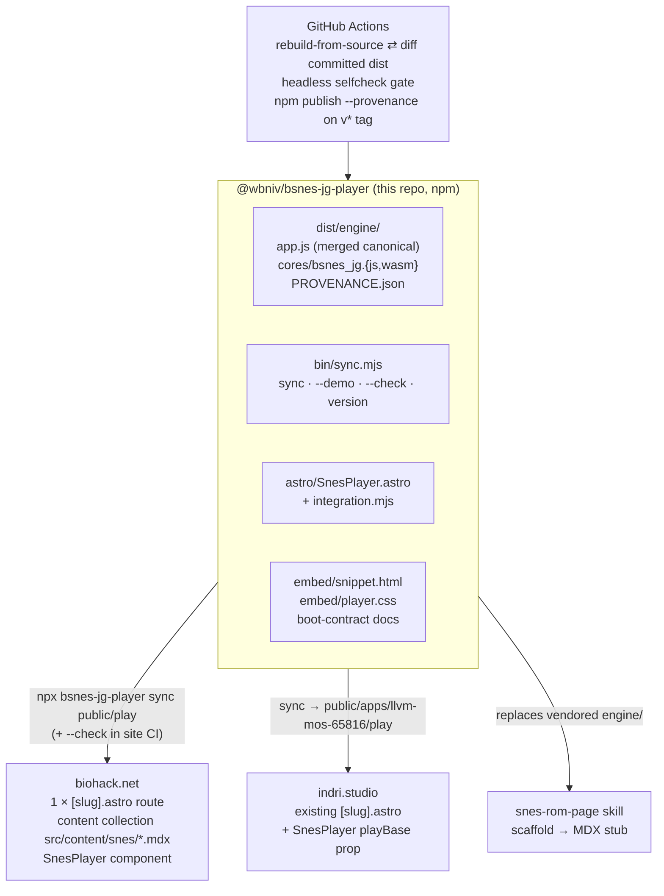
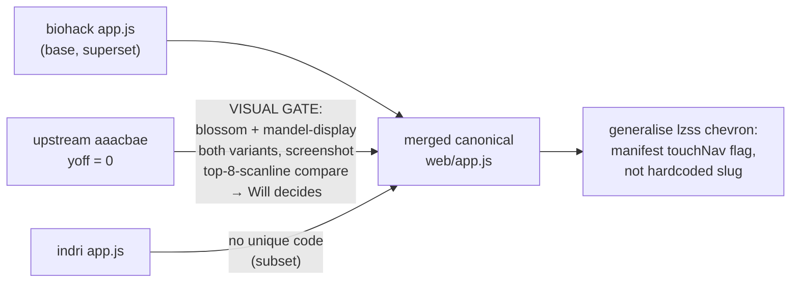
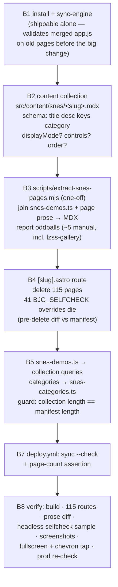

# bsnes-jg player → reusable npm package + biohack.net migration

*2026-07-27 · master plan copy: [~/.config/claude/will/plans/custom-emscripten-build-of-stateless-map.md](../../../.config/claude/will/plans/custom-emscripten-build-of-stateless-map.md) (this file is the in-repo contract)*

## Context

The in-browser SNES player (our Emscripten build of bsnes-jg 2.1.0 — no libretro, no EmulatorJS) has this repo as its upstream, but it has drifted into **three divergent copies** of `app.js`, and biohack.net duplicates the embed markup + sha256 cache-bust loop + boot script + `.rp-*` CSS across **114 hand-written pages** (41 still carrying legacy `BJG_SELFCHECK` overrides). indri.studio already uses one dynamic route but syncs assets by hand-rolled script.

Goal: make this repo the single distributable source of truth — an npm package (`@wbniv/bsnes-jg-player`, GPL-3.0-only) shipping the prebuilt core, the merged canonical `app.js`, a framework-agnostic embed (snippet + CSS + boot contract), and an Astro component — then migrate biohack.net onto it with one dynamic route + a content collection, preserving per-page prose and `/snes/<slug>/` URLs.

### The drift today



### Target state



**User decisions (locked):** npm package · ship framework-agnostic embed AND Astro component · biohack collapses to `[slug].astro` + content collection (prose → MDX) · merge all three app.js copies — but the `yoff` fix needs a visual gate (Will unsure it's correct/desired).

---

## Phase A — upstream merge + npm package (this repo)

### A1. app.js reconciliation (with yoff decision gate)

Base = biohack's `public/play/app.js` (feature superset). The only upstream-exclusive delta is `aaacbae`: `var yoff = 0;` vs the sites' `var yoff = h >= 232 ? 8 : 0;`.



Gate rule: if `yoff=0` shows garbage/blank rows at the top → keep the site variant; if it reveals real content the sites were cropping (upstream's commit claims it clipped /blossom's value bar and mis-framed mandel by 8 px) → adopt it. Both screenshots go to Will for the call.

> **GATE RESULT (2026-07-27, measured per-row from the live framebuffer, deterministic frame counts after `_bjg_reset()`):** buffer is 512×240; content rows are **8–221** (blossom @ frame 900) and **8–232** (mandel-display @ frame 1500). `yoff=8` shows everything flush (mandel loses only edge row 232); `yoff=0` adds an 8 px black band, shifts the picture down, and crops 9 content rows off mandel's bottom. Upstream `aaacbae`'s rationale ("picture sits flush at buffer top") describes the headless jgxcheck capture, not this build's video buffer. **Decision: keep the adaptive `yoff = h >= 232 ? 8 : 0`** — it already degrades to 0 for a 224-line buffer. Upstream `web/app.js` gets the site formula back; `aaacbae`'s comment is superseded. The "keep both site copies byte-identical" comment dies — replaced by "sites vendor exactly what the sync CLI copies".

### A2. Package layout (package-in-repo at root)

```
package.json                # @wbniv/bsnes-jg-player, GPL-3.0-only, type: module
bin/sync.mjs                # CLI: sync / --demo / --check / version (zero deps)
dist/                       # COMMITTED prebuilt artifacts (what npm ships)
  engine/{app.js, cores/bsnes_jg.js, cores/bsnes_jg.wasm, cores/PROVENANCE.json}
  demo/{roms/mandel-display.sfc, roms/manifest.json, preview/mandel-display.png}
astro/{index.ts, SnesPlayer.astro, integration.mjs}
embed/{snippet.html, player.css}
scripts/stage-dist.sh       # web/app.js (single source) → dist/engine/
web/ …                      # dev harness, unchanged
.github/workflows/{ci.yml, publish.yml}
```

`package.json`: `bin`, `files: [dist, astro, embed, bin, LICENSE, README.md]`, exports for `./SnesPlayer.astro`, `./integration`, `./css`, `./engine/*`; astro as optional peerDep. Confirm `@wbniv` npm scope (fallback: unscoped `bsnes-jg-player`).

Prebuilt wasm **committed**; CI rebuilds from source (build.sh is reproducible: pinned emsdk + pinned tarball sha256) and diffs against committed artifacts — mismatch fails CI. Publish never waits on an emsdk build; installing straight from a git URL also works.

### A3. Sync CLI

- `npx bsnes-jg-player sync <dest>` — copies `dist/engine/*`, writes `<dest>/ENGINE_VERSION` (pkg version + content hashes). Never touches `roms/`/`preview/` unless `--demo`.
- `--check` — byte-for-byte verify against installed package (site CI anti-drift gate).
- No postinstall; sites wire `"sync-engine": "bsnes-jg-player sync public/play"`.

**Cache-busting stays per-file sha256 `?v=`** — version-stamped dirs would bust 4.6 MB of unchanged ROMs/previews per engine bump and churn URLs. The Astro component computes the hashes, so the duplicated frontmatter loop disappears.

### A4. Astro component + integration + framework-agnostic embed

`astro/SnesPlayer.astro` — props `slug, title, keys, playBase='/play', controls?, class?`. Renders the `#bjg-embed` markup (lifted from the snes-rom-page skill's page-template), computes the bust map in frontmatter, emits the `is:inline` boot script, imports `embed/player.css`. ~120 lines deleted from every consuming page. Mockup: [npm-player-package/snes-player-page.png → .html](2026-07-27-npm-player-package/).

`astro/integration.mjs` — optional, tiny: on `astro:config:setup` checks `public/play/ENGINE_VERSION` matches the installed package; warns/errors on drift. Does **not** copy files.

`embed/snippet.html` + `embed/player.css` + README boot-contract docs (globals `BJG_BASE/BJG_DEFAULT_ROM/BJG_BUST`, element IDs `#screen #status #verify #checkresult #banner #fullscreen`, keymap, manifest selfcheck format). No custom element for now — app.js is ID/globals-driven; shadow DOM would force a rewrite. `<bsnes-player>` is a possible later major.

### A5. CI + publish (Node 24-native action majors: checkout@v6, setup-node@v6, cache@v5)

`ci.yml` (push/PR): emsdk cached on build.sh hash → `./build.sh` → diff built cores vs committed `dist/engine/cores/` → headless Chrome boots mandel-display, polls `#checkresult` for selfcheck PASS (fallback if ASYNCIFY+headless flaky: core loads + first non-black frame ≤ N s) → `sync --demo` smoke test.

`publish.yml` (on `v*` tag): same gates, then `npm publish --access public --provenance`. Taskfile: `task package`, `task publish-dry`.

---

## Phase B — biohack.net migration



Fidelity check for B3: build before/after, diff rendered `dist/snes/<slug>/index.html` **prose region** per slug (whitespace-normalized, embed/script stripped). B4 pre-delete guard: compare each override's `off/len/want/frames` against the manifest; mismatches flagged to Will before deletion. Note in the commit message that the snes-rom-page skill is broken until Phase C.

---

## Phase C — follow-ups

- **indri.studio:** install package; replace `scripts/sync-llvm-mos-emulator.sh` with the sync CLI; `EmulatorEmbed.astro` → `<SnesPlayer playBase="/apps/llvm-mos-65816/play">`; Base.astro boot logic removed. indri inherits poster clear-to-black (intentional; flag it).
- **snes-rom-page skill:** delete vendored `engine/`; scaffold.sh → copies ROM+preview, appends manifest entry, creates `src/content/snes/<slug>.mdx` stub; drop snes-demos.ts append; update SKILL.md.

## Risks

- **yoff** — one line, gated by explicit screenshots + Will's call.
- **41 selfcheck overrides** — pre-delete comparison de-risks silent verify-behaviour changes.
- **Prose extraction** — notes-array pattern is mostly data-transform; rendered-HTML diff catches the rest; ~5 manual pages budgeted.
- **Headless ASYNCIFY wasm in CI** — fallback criterion in A5.
- **npm scope** — confirm `@wbniv` availability.

## Verification

1. **A (package):** `./build.sh` reproduces committed `dist/engine/cores/` byte-identically; `node bin/sync.mjs sync /tmp/out --demo` emits the expected file list; `npm pack --dry-run` ships only `files:`; headless demo page reaches `#checkresult` PASS; yoff screenshots recorded + decision noted here.
2. **B1:** biohack build green after engine sync; 3 pages click-tested (boot, verify, fullscreen).
3. **B2–B5:** `pnpm build` green; `ls dist/snes/*/index.html | wc -l` == 115; check-links pass; prose-diff report clean; headless selfcheck sample (mandel-display, blossom, lzss-gallery, 3d-wireframe, one per category) all PASS; lzss chevron tap works under touch emulation.
4. **Deploy:** tag → Pages deploy → re-run headless sample against production.

## Mockups

Visible surfaces: the `SnesPlayer` embed as rendered by the new biohack `[slug].astro` route (player + controls + prose from MDX), and its error state (engine missing / ENGINE_VERSION drift). Bundle: [2026-07-27-npm-player-package/](2026-07-27-npm-player-package/)

- [](2026-07-27-npm-player-package/snes-player-page.html)
- [](2026-07-27-npm-player-package/snes-player-drift-error.html)
