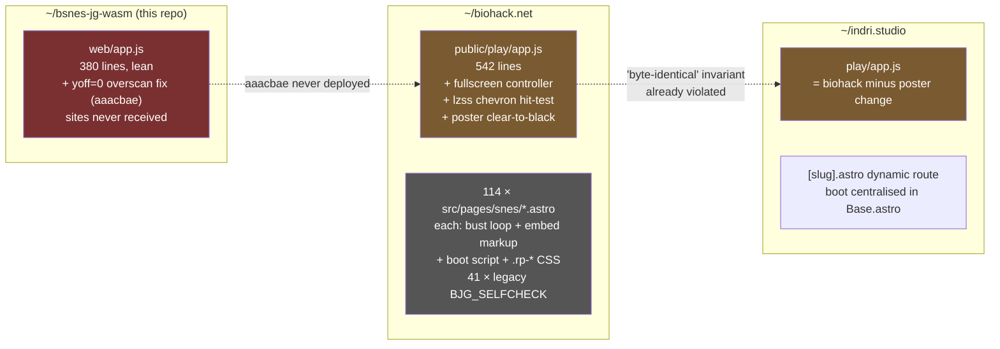
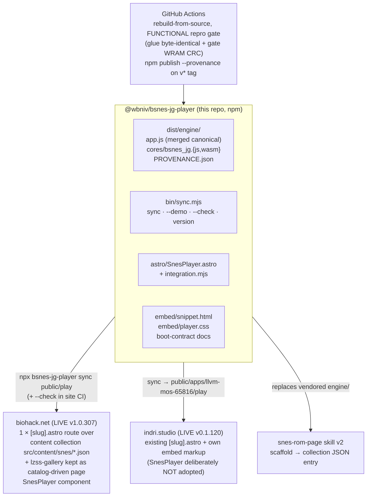
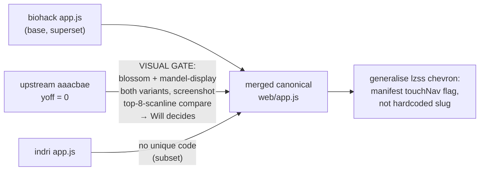
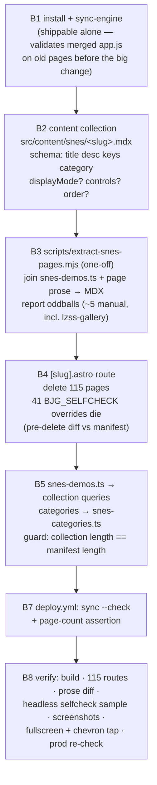
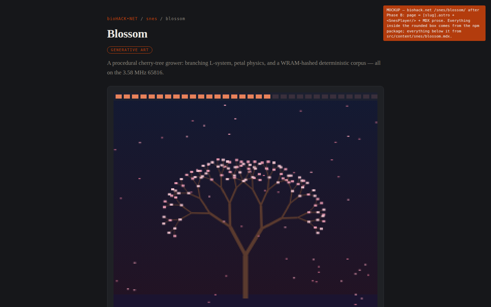
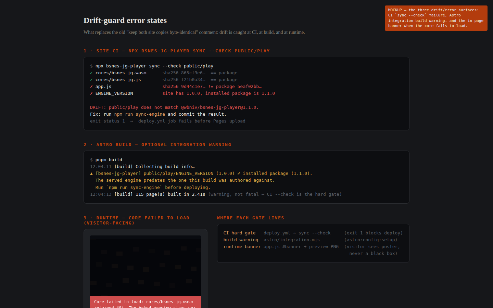

# bsnes-jg player → reusable npm package + biohack.net migration

*2026-07-27 · master plan copy: [~/.config/claude/will/plans/custom-emscripten-build-of-stateless-map.md](../../../.config/claude/will/plans/custom-emscripten-build-of-stateless-map.md) (this file is the in-repo contract)*

> **STATUS (2026-07-27, end of day): ALL THREE PHASES LANDED AND LIVE.**
> Phase A on this repo's `npm-package` branch (CI green); Phase B deployed as biohack.net
> **v1.0.307** (prod selfcheck `0x204F == gate`); Phase C deployed as indri.studio **v0.1.120**
> (prod selfcheck PASS, `ENGINE_VERSION 1.0.0` served) + snes-rom-page skill v2.
> **The one open item is the first npm publish** — blocked on the manual npm-account step
> (create `wbniv` on npm → granular token → `NPM_TOKEN` repo secret → tag `v1.0.0`); until then
> both sites consume the git dep `github:wbniv/bsnes-jg-wasm#npm-package`.
> Deviations from the plan as written are marked **DEVIATION** inline; per-site verification
> evidence lives in [biohack's plan stub](../../../biohack.net/docs/plans/2026-07-27-snes-package-migration.md)
> and [indri's plan stub](../../../indri.studio/docs/plans/2026-07-27-snes-package-adoption.md).

## Context

The in-browser SNES player (our Emscripten build of bsnes-jg 2.1.0 — no libretro, no EmulatorJS) has this repo as its upstream, but it has drifted into **three divergent copies** of `app.js`, and biohack.net duplicates the embed markup + sha256 cache-bust loop + boot script + `.rp-*` CSS across **114 hand-written pages** (41 still carrying legacy `BJG_SELFCHECK` overrides). indri.studio already uses one dynamic route but syncs assets by hand-rolled script.

Goal: make this repo the single distributable source of truth — an npm package (`@wbniv/bsnes-jg-player`, GPL-3.0-only) shipping the prebuilt core, the merged canonical `app.js`, a framework-agnostic embed (snippet + CSS + boot contract), and an Astro component — then migrate biohack.net onto it with one dynamic route + a content collection, preserving per-page prose and `/snes/<slug>/` URLs.

### The drift today



### Target state



*(Diagram reflects as-built: see the DEVIATION notes below for where it moved off the original sketch.)*

**User decisions (locked):** npm package · ship framework-agnostic embed AND Astro component · biohack collapses to `[slug].astro` + content collection (prose → MDX) · merge all three app.js copies — but the `yoff` fix needs a visual gate (Will unsure it's correct/desired).

---

## Phase A — upstream merge + npm package (this repo)

### A1. app.js reconciliation (with yoff decision gate)

Base = biohack's `public/play/app.js` (feature superset). The only upstream-exclusive delta is `aaacbae`: `var yoff = 0;` vs the sites' `var yoff = h >= 232 ? 8 : 0;`.



Gate rule: if `yoff=0` shows garbage/blank rows at the top → keep the site variant; if it reveals real content the sites were cropping (upstream's commit claims it clipped /blossom's value bar and mis-framed mandel by 8 px) → adopt it. Both screenshots go to Will for the call.

> **GATE RESULT (2026-07-27, measured per-row from the live framebuffer, deterministic frame counts after `_bjg_reset()`):** buffer is 512×240; content rows are **8–221** (blossom @ frame 900) and **8–232** (mandel-display @ frame 1500). `yoff=8` shows everything flush (mandel loses only edge row 232); `yoff=0` adds an 8 px black band, shifts the picture down, and crops 9 content rows off mandel's bottom. Upstream `aaacbae`'s rationale ("picture sits flush at buffer top") describes the headless jgxcheck capture, not this build's video buffer. **Decision: keep the adaptive `yoff = h >= 232 ? 8 : 0`** — it already degrades to 0 for a 224-line buffer. Upstream `web/app.js` gets the site formula back; `aaacbae`'s comment is superseded.
>
> History note: indri's [2026-06-27 overscan-crop fix](../../../indri.studio/docs/plans/2026-06-27-emulator-hud-overscan-crop-fix.md) shows `aaacbae`'s `yoff=0` DID fix a real clip in June — the buffer was flush-top then. Today's core hands a 240-row buffer with rows 0–7 blank, which is exactly why the sites' formula is *adaptive* rather than either constant. The "keep both site copies byte-identical" comment dies — replaced by "sites vendor exactly what the sync CLI copies".

### A2. Package layout (package-in-repo at root)

```
package.json                # @wbniv/bsnes-jg-player, GPL-3.0-only, type: module
bin/sync.mjs                # CLI: sync / --demo / --check / version (zero deps)
dist/                       # COMMITTED prebuilt artifacts (what npm ships)
  engine/{app.js, cores/bsnes_jg.js, cores/bsnes_jg.wasm, cores/PROVENANCE.json}
  demo/{roms/mandel-display.sfc, roms/manifest.json, preview/mandel-display.png}
astro/{index.ts, SnesPlayer.astro, integration.mjs}
embed/{snippet.html, player.css}
scripts/stage-dist.sh       # web/app.js (single source) → dist/engine/
web/ …                      # dev harness, unchanged
.github/workflows/{ci.yml, publish.yml}
```

`package.json`: `bin`, `files: [dist, astro, embed, bin, LICENSE, README.md]`, exports for `./SnesPlayer.astro`, `./integration`, `./css`, `./engine/*`; astro as optional peerDep. ~~Confirm `@wbniv` npm scope~~ *(checked: the npm user `wbniv` doesn't exist yet and both names are free — creating the account is the open manual step).*

Prebuilt wasm **committed**; CI rebuilds from source and verifies against the committed artifacts. **DEVIATION:** the verify is *functional*, not `cmp` — see the bitwise-reproducibility finding under Risks. Publish never waits on an emsdk build; installing straight from a git URL also works *(and is how both sites consume it pre-publish)*.

### A3. Sync CLI

- `npx bsnes-jg-player sync <dest>` — copies `dist/engine/*`, writes `<dest>/ENGINE_VERSION` (pkg version + content hashes). Never touches `roms/`/`preview/` unless `--demo`.
- `--check` — byte-for-byte verify against installed package (site CI anti-drift gate).
- No postinstall; sites wire `"sync-engine": "bsnes-jg-player sync public/play"`.

**Cache-busting stays per-file sha256 `?v=`** — version-stamped dirs would bust 4.6 MB of unchanged ROMs/previews per engine bump and churn URLs. The Astro component computes the hashes, so the duplicated frontmatter loop disappears.

### A4. Astro component + integration + framework-agnostic embed

`astro/SnesPlayer.astro` — props `slug, title, keys, playBase='/play', fullscreen?, verifyLabel?, class?` + a slot for extra key-help lines *(as-built: `controls?` was dropped — the controls table stayed page/route content; `verifyLabel` was added for lzss-gallery's "Verify benchmark")*. Renders the `#bjg-embed` markup (lifted from the snes-rom-page skill's page-template), computes the bust map in frontmatter, emits the `is:inline` boot script, imports `embed/player.css`. ~120 lines deleted from every consuming page. Mockup: [npm-player-package/snes-player-page.png → .html](2026-07-27-npm-player-package/).

`astro/integration.mjs` — optional, tiny: on `astro:config:setup` checks `public/play/ENGINE_VERSION` matches the installed package; warns/errors on drift. Does **not** copy files.

`embed/snippet.html` + `embed/player.css` + README boot-contract docs (globals `BJG_BASE/BJG_DEFAULT_ROM/BJG_BUST`, element IDs `#screen #status #verify #checkresult #banner #fullscreen`, keymap, manifest selfcheck format). No custom element for now — app.js is ID/globals-driven; shadow DOM would force a rewrite. `<bsnes-player>` is a possible later major.

### A5. CI + publish (Node 24-native action majors: checkout@v6, setup-node@v6, cache@v5)

`ci.yml` (push/PR): emsdk cached on build.sh hash (pinned **6.0.1**, matching PROVENANCE) → `./build.sh` → **functional repro gate** (glue + app.js `cmp`, wasm size ≤1%, gate WRAM CRC on both rebuilt AND committed cores via the `?verify=1` hook added to app.js) → `sync --demo` smoke incl. tamper-must-fail → `npm pack` sanity. Green: [run 30303535793](https://github.com/wbniv/bsnes-jg-wasm/actions/runs/30303535793).

`publish.yml` (on `v*` tag): same gates + tag==version check, then `npm publish --access public --provenance`. Taskfile: `task package`, `task publish-dry`, `task sync-smoke`. **Awaiting the npm-account manual step before the first `v1.0.0` tag.**

---

## Phase B — biohack.net migration



Fidelity check for B3: build before/after, diff rendered `dist/snes/<slug>/index.html` **prose region** per slug (whitespace-normalized, embed/script stripped). B4 pre-delete guard: compare each override's `off/len/want/frames` against the manifest; mismatches flagged to Will before deletion. Note in the commit message that the snes-rom-page skill is broken until Phase C.

**DEVIATIONS as built (all landed in biohack v1.0.307):**

- **JSON data collection, not MDX.** The pages' prose is thick with JSX interpolations and raw `{`/`}` in code blocks (all 114 pages had non-trivial `{expr}` in `.rp-doc`), which MDX parses as expressions. Instead, the one-off extractor pulled the **rendered regions out of the built HTML** (exact by construction) into `src/content/snes/<slug>.json` with HTML-string bodies rendered via `set:html`. Prose-fidelity diff: **114/114 clean**.
- **The 41 `BJG_SELFCHECK` overrides were already dead code** — the deployed `app.js` never read them (the manifest has been authoritative all along); 40 were stale vs the manifest. Deleting them changed nothing, no user decision needed.
- **lzss-gallery stays a real `.astro` page** (post-merge): master's `304c27b` made it catalog-driven (`src/data/lzss-gallery-catalog.json`, 62 works, derived counts) — inexpressible as a static collection entry. It renders on `<SnesPlayer verifyLabel="Verify benchmark">`, its collection entry is gallery-card-only (prose fields now optional in the schema), the `[slug]` route skips prose-less entries, and the page build-asserts the entry's baked artwork count against the catalog. So: **113 dynamic pages + 1 catalog-driven page = 114**.
- The extractor script was deleted after landing (plan B3's intent); it lives in git history.

---

## Phase C — follow-ups

- **indri.studio** *(landed, v0.1.120)*: package installed; `scripts/sync-llvm-mos-emulator.sh` became a thin wrapper over the sync CLI; `sync --check` drift gate in deploy.yml. **DEVIATION:** indri **keeps its own embed markup + Base.astro boot** — they're already centralized and carry the site's glass-card/lime branding; `<SnesPlayer/>` would have swapped that for generic chrome with zero dedup gain. The boot contract is unchanged, so indri's markup drives the packaged engine as-is. It does inherit poster clear-to-black + manifest touchNav + the yoff decision (intentional).
- **snes-rom-page skill** *(landed, v2.0.0)*: vendored `engine/` + `page-template.astro` deleted (4 MB → 28 KB); scaffold.sh syncs the engine from the site's installed package, gains `--playdir` and `--touchnav`, and the biohack content step is "write `src/content/snes/<slug>.json`" (JSON, not MDX — matching the B deviation); snes-demos.ts append dropped; SKILL.md rewritten for both sites' as-built layouts.

## Risks

- **yoff** — one line, gated by explicit screenshots + Will's call. *(Resolved: measured per-row instead — adaptive formula kept; see gate result box.)*
- **41 selfcheck overrides** — pre-delete comparison de-risks silent verify-behaviour changes. *(Resolved: they were dead code; deployed app.js never read them.)*
- **Prose extraction** — notes-array pattern is mostly data-transform; rendered-HTML diff catches the rest; ~5 manual pages budgeted. *(Resolved: extraction from BUILT HTML made all 114 mechanical — zero manual pages; only lzss-gallery diverged, by staying a real page.)*
- **Headless ASYNCIFY wasm in CI** — fallback criterion in A5. *(Resolved 2026-07-27: `?verify=1` auto-check under `--virtual-time-budget` PASSes reliably.)*
- **Bitwise wasm reproducibility** — *disproved 2026-07-27*: emcc 6.0.1 from identical pinned inputs produces byte-different wasm on different hosts (local vs GH runner diverge from each other at the same structural byte — a stack/global initializer; ~3.3 M bytes shift downstream). The CI gate is therefore **functional**: JS glue (ABI) byte-identical + app.js byte-identical + wasm size within 1% + the differential-gate WRAM CRC PASSing on both the rebuilt and the committed core.
- **npm scope** — confirm `@wbniv` availability.

## Verification

1. **A (package):** `./build.sh` reproduces committed `dist/engine/cores/` byte-identically; `node bin/sync.mjs sync /tmp/out --demo` emits the expected file list; `npm pack --dry-run` ships only `files:`; headless demo page reaches `#checkresult` PASS; yoff screenshots recorded + decision noted here.

    ```
    byte-identical: DISPROVED cross-host (see Risks) → functional gate instead:
      glue+app.js cmp OK · wasm size Δ50 B (≤1%) · gate CRC PASS on rebuilt AND committed cores
    sync smoke: 4 engine files + ENGINE_VERSION + demo; tampered app.js correctly exits 1
    npm pack --dry-run: 17 files, 1.9 MB tarball
    headless web/?rom=mandel-display&verify=1:
      ✓ FIDELITY 0x204F == gate (gate jgxcheck CRC (corpus_result @ WRAM $0200), 5800 frames)
    yoff: measured per-row (not screenshots — stronger): buffer 512×240, content rows 8–221
      (blossom @900) / 8–232 (mandel @1500) ⇒ adaptive h>=232?8:0 kept; gate result box above.
    ```
    PASS (2026-07-27) — CI: [run 30303535793](https://github.com/wbniv/bsnes-jg-wasm/actions/runs/30303535793)

2. **B1:** biohack build green after engine sync; old pages still worked (contract unchanged). PASS.

3. **B2–B5:** `pnpm build` green; **114** demo pages (113 dynamic + lzss static — see DEVIATION) + gallery index; prose-diff **114/114 clean**; selfcheck sample PASS (mandel `0x204F`, blossom `0x9047` headless; lzss chevrons/label/62-cards live-tested — its 200 000-frame benchmark selfcheck is impractical headless and ships user-facing with the `0x5CF0` oracle from biohack `304c27b`). Full raw evidence: [biohack plan stub](../../../biohack.net/docs/plans/2026-07-27-snes-package-migration.md).

4. **Deploy:** biohack **v1.0.307** → Pages deploy green (incl. the new `sync --check` + page-count gates) → prod re-check:

    ```
    prod mandel: ✓ FIDELITY 0x204F == gate (badge pass)
    prod lzss:   "62 artworks form" · "Verify benchmark" · gallery "114 Super Nintendo programs"
    indri v0.1.120: prod mandel badge pass · ENGINE_VERSION @wbniv/bsnes-jg-player 1.0.0
    ```
    PASS (2026-07-27)

## Mockups

Visible surfaces: the `SnesPlayer` embed as rendered by the new biohack `[slug].astro` route (player + controls + collection prose), and its error state (engine missing / ENGINE_VERSION drift). Bundle: [2026-07-27-npm-player-package/](2026-07-27-npm-player-package/) *(as-shipped pages match the mockup; live: [biohack.net/snes/blossom/](https://biohack.net/snes/blossom/))*

- [](2026-07-27-npm-player-package/snes-player-page.html)
- [](2026-07-27-npm-player-package/snes-player-drift-error.html)
